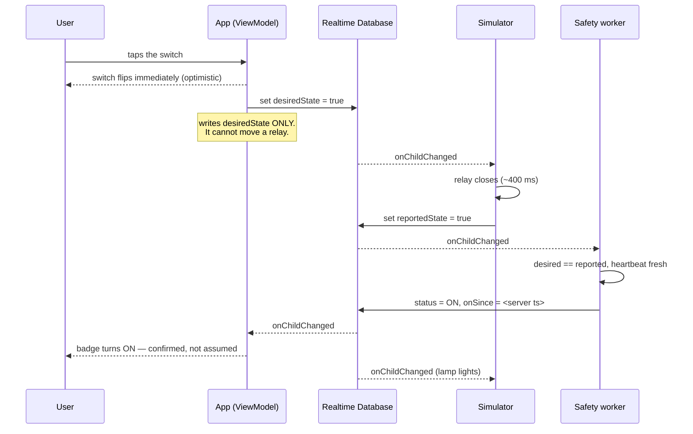

# HomeSense — technical report

**SCS 3311 · Smart Home Monitoring & Control System**

An Android client, a cloud-connected hardware simulation and a server-side
safety worker. This report covers the three things the specification asks for:
the **synchronising mechanism**, the **floor representation**, and the
**simulator operations**. Architecture, safety rules and limitations are folded
under those headings; an appendix lists the design decisions.

---

## 1. Synchronising mechanism

### 1.1 The idea the system is built on

Every controllable point in the house — a socket, one channel of a gang box — is
a **slot**, and every slot carries three separate booleans rather than one:

| Field | Meaning | Written by |
|---|---|---|
| `desiredState` | "The user wants this on." | the **app** (and the worker, for cut-offs and schedules) |
| `reportedState` | "The relay is actually closed." | the **simulator** |
| `status` | The reconciled truth the UI renders. | the **worker** |

One boolean cannot express the difference between *asked for*, *actually
happening*, and *what we believe*. Three can, and that is what makes `ERROR` and
`DISCONNECTED` observed facts instead of decorative badges:

- `ERROR` arises only from a **sustained disagreement** between what was asked
  for and what is reported. A brief disagreement is not a fault — it is a
  command in flight — so the worker requires the mismatch to persist for 10
  seconds before classifying it.
- `DISCONNECTED` arises only from **silence**: a heartbeat older than 15
  seconds. It outranks every other state, because if nobody has told us what a
  relay is doing, reporting `OFF` would be a guess presented as a fact.

### 1.2 Why Realtime Database rather than Firestore

Realtime Database gives per-child listeners, so toggling one slot delivers one
small `onChildChanged` carrying that device — not a re-send of the whole
`/devices` subtree. It also provides `onDisconnect()`, which lets the *server*
record a client's disappearance rather than leaving the app to infer it.

Firestore's document-granularity listeners and higher write latency are the
wrong shape for a grid of independently toggled slots. The cost of the choice —
no meaningful queries, a denormalised tree kept consistent by hand — is
acceptable because the tree is small, fixed, and pinned down in
`docs/SCHEMA.md`.

### 1.3 How a change actually travels

Three properties follow from that shape:

**No manual refresh exists.** `HomeRepository` has no `refresh()`, `reload()` or
`fetch()` method — there is nothing to call. The device list is a `StateFlow`
fed directly by child listeners, so a change made by the simulator, by the
worker, or by a second phone arrives as a callback and re-renders the screen.
"Updates with no manual refresh" is not a feature that was added; it is the only
behaviour this design can produce. The repository tests demonstrate it by
pushing a change onto the source and asserting the flow carries it, without ever
calling into the repository.

**Optimistic, but honest.** The switch flips at once, because waiting for a
round trip feels broken. But the app only writes `desiredState`, so the
optimistic position is held for at most **4 seconds**; if `reportedState` has
not followed, the switch snaps back and the user is told. Four seconds sits
deliberately between a normal round trip and the worker's 10-second `ERROR`
threshold, so the user is warned slightly *before* the badge officially turns
red.

**The split is enforced, not merely intended.** In Realtime Database a `.write`
grant cascades to every descendant and cannot be revoked further down — a
deeper `.write: false` does nothing. What *can* restrict a client is
`.validate`, and the Admin SDK bypasses validation entirely. `database.rules.json`
uses that asymmetry: `status`, `link`, `onSince` and `mismatchSince` carry
validators that pass only when the value is **unchanged**. A signed-in client is
therefore physically unable to publish a status. It cannot claim a device is
healthy, cannot clear an `ERROR`, and cannot silence a `DISCONNECTED`.

**Honest limitation.** The app and the simulator both authenticate anonymously,
so the rules cannot tell them apart: a modified client could write
`reportedState` as though it were the hardware. Distinguishing the two roles
needs custom claims and a backend to mint them, which is out of scope here. What
no client can do is write `status` — and that is the property the safety
argument rests on.

### 1.4 Offline behaviour

Realtime Database disk persistence is enabled, so the last known tree is on the
device and the first frame after a cold start shows real data. Room mirrors
floors, layout, alerts and the usage log — not live status, deliberately, since
a stale `ON` badge from last week is worse than an honest `DISCONNECTED`.

Usage events are **append-only**, logged at the moment of transition by
whichever actor caused it, and never recomputed by diffing snapshots. Diffing
would silently lose every transition that happened while the app was closed —
precisely the window the safety worker exists to cover.

---

## 2. Floor representation

### 2.1 Cells, not pixels

A **device** is one physical node: one grid cell, one connection, one heartbeat.
Its position is stored as **integer cell coordinates**, never pixels, so a plan
renders identically on a 5-inch phone and a tablet in either orientation.

All translation between cells and screen coordinates lives in one pure class,
`GridMapper`, with no Android dependency — which is what lets it be tested
exhaustively. Sixteen unit tests cover the cell↔pixel round trip, the letterbox
bars, the exact behaviour on cell boundaries and plan edges, degenerate zero-
sized canvases, and the property that matters most: **the same cell resolves to
the same cell on phone and tablet geometry**. Floating-point placement bugs are
the kind that only appear in front of an examiner, so they are pinned down by
tests rather than by inspection.

The plan image is fitted inside the canvas preserving its aspect ratio, which
means letterbox bars on two sides. All cell arithmetic happens inside the fitted
rectangle, never against raw canvas bounds — otherwise every device would drift
as the window shape changed.

### 2.2 Plans as geometry

The specification asks for an **abstract, simple** mapping, and we took that
literally. Plans are declared as rooms, doors and windows in a unit-less
coordinate space (`FloorPlanSpec`) and drawn with Compose `Canvas`. Three
consequences, all of them wanted:

- crisp at every screen density, with no bitmap to scale;
- an exact aspect ratio, so the letterboxing is exact;
- no third-party image licence to track — the plans are our own work.

Three sample plans ship with the app (ground floor, first floor, annex), plus a
blank grid. A floor stores only the plan's id, so changing a floor's layout
never disturbs the devices placed on it.

### 2.3 Reading a plan at a glance

Markers encode **kind by shape** and **status by fill pattern**:

| | |
|---|---|
| Outlet | circle |
| Gang box | square, with one pip per addressable slot |
| Camera | body-and-lens outline |
| `ON` | solid fill |
| `OFF` | plain outline |
| `ERROR` | outline plus a cross |
| `DISCONNECTED` | dashed outline |

Nothing is conveyed by colour alone, anywhere in the app — status is always
colour **plus** icon **plus** text. That is an accessibility requirement, and it
is also what keeps the screen readable when a lecture-theatre projector washes
the colours out.

A gang box's marker shows the **most alarming** of its slot statuses: a fault on
one channel must not be hidden by two healthy ones.

### 2.4 One gang box is one entity

The specification requires a multi-switch unit be "mapped to a single entity in
the system", and the data model makes any other shape unrepresentable: `Device`
holds a `List<Slot>`, so a five-gang plate is one `deviceId`, one grid cell, one
heartbeat, with five independently addressable slots and a master that addresses
each in turn. There is no code path anywhere that splits one into several.

The corresponding modelling insight is that `max_on_duration` and `schedule`
belong to a **slot**, not to a device type. Had we modelled `HAZARD` and `LIGHT`
as device kinds, it would have been impossible to put an iron in an ordinary
socket or a timed bulb on channel 2 of a gang box — which are the realistic
cases, not the exotic ones.

The field is spelled `max_on_duration` on the wire, exactly as the
specification spells it, with the rename to an idiomatic Kotlin property done in
one visible place.

---

## 3. Simulator operations

### 3.1 What it is

`simulator/index.html` — a single self-contained page using the Firebase Web SDK
from a CDN. No build step, no server: open it in a browser. It stands in for the
physical appliances, and it is a *participant* in the protocol, not a viewer of
it.

It renders a card per device grouped by floor. Lamps glow when their slot is on,
hazardous slots show a heat bar filling toward `max_on_duration`, and cameras
cycle a mock stream.

### 3.2 What it writes, and what it does not

The simulator writes exactly two things: `reportedState`, when its relay moves,
and `lastSeen`, every five seconds. **It never writes `status`.** It is hardware;
hardware reports, it does not adjudicate. The same restriction the app operates
under, for the same reason and enforced by the same rules file.

It also registers an `onDisconnect()` handler that pins `lastSeen` to 0. Closing
the browser tab therefore makes the node `DISCONNECTED` on the phone within the
worker's 15-second window — and the absence is recorded *by the server*, not
inferred by anyone.

### 3.3 The three chaos controls

Each button exists to make one requirement demonstrable rather than asserted:

| Control | What it does | What it proves |
|---|---|---|
| **Simulate fault** | The relay stops obeying commands entirely | `desiredState` and `reportedState` diverge and stay diverged; after 10 s the worker publishes `ERROR`. The app never wrote it. |
| **Unplug** | The heartbeat stops | `lastSeen` goes stale; the worker publishes `DISCONNECTED`. Silence is measured, not guessed. |
| **Physical toggle** | A change originating at the hardware | Appears on the phone with no refresh, logged with `source: SIMULATOR`. Nothing in the app initiated it. |

The fault case is the most instructive. The simulator does not write `ERROR` —
it simply stops obeying. The error is *derived*, by a third process, from a
disagreement between two other processes. That is a genuinely different claim
from an app setting a red badge on itself.

### 3.4 The safety worker

The cut-off runs in `/worker` — a Node + TypeScript process using
`firebase-admin` — and never in the app. The whole point of the requirement is
that it protects life and property when the phone is off.

Cloud Functions would need the Blaze plan and a card on file, so the worker is a
plain process runnable locally or on a free Render/Railway instance. Every rule
lives in `worker/src/rules/` as a **pure function with an injected clock**, and
`executor.ts` is the only file that touches Firebase — so the rules would lift
into a Cloud Function unchanged. `docs/CLOUD_FUNCTIONS.md` shows that migration
and is candid about the one place the free-tier design is actually *better*:
Cloud Scheduler's floor is one minute, where our sweep runs every thirty
seconds.

Four rules run against every device:

- **`maxOnDurationRule`** — the cut-off. Writes `desiredState = false`, appends
  a `CUTOFF` usage event, raises a `CRITICAL` alert and pushes an FCM message.
- **`statusRule`** — derives `status` and owns `onSince` and `mismatchSince`.
- **`staleHeartbeatRule`** — heartbeat older than 15 s → `DISCONNECTED`.
- **`scheduleRule`** — minute-boundary on/off windows for lights.

### 3.5 The detail that matters most

**Timer state lives in the database, not in memory.** `onSince` is stored, and
elapsed time is recomputed from it on every evaluation. A `setTimeout` armed at
switch-on would die with the process — and it would die *silently*, which is
worse than dying loudly.

Because the state is stored, a worker that crashes, redeploys, or has its laptop
lid closed loses nothing: the next pass sees an iron 47 seconds into a
30-second limit and cuts it off immediately. There is a Jest test for exactly
that scenario, and another proving the cut-off fires at exactly
`max_on_duration` — not one second early, not one second late.

Two triggers drive the same pure evaluation: child listeners for millisecond
reaction, and a 30-second sweep for guaranteed recovery. Because both call the
identical function, they cannot disagree.

The schedule rule fires on **boundaries, not levels**: it acts at the on-minute
and the off-minute only. Asserting the whole window would mean a user who
switched a scheduled light off at 19:00 found it back on within a minute. The
cost — a boundary missed entirely while the worker was down is not retro-applied
— is the right trade, and is stated here rather than hidden.

---

## Appendix A — architecture and stack

Kotlin, Jetpack Compose (Material 3), MVVM: `Composable → ViewModel (StateFlow)
→ Repository → data source`. No composable touches Firebase or Room directly.
`minSdk 26`, `targetSdk 35`, Gradle Kotlin DSL with a version catalog.

Dependency injection is done by hand in `AppContainer` — twenty lines, for an
app with one repository. A DI framework would be a fourth thing for three people
to defend orally, for no benefit at this size.

Two product flavours: `live` talks to Realtime Database; `demo` runs on an
in-memory backend that plays simulator, worker and cloud at once, including a
genuine safety cut-off. The demo build exercises the real repository, real
ViewModels and real UI with no network — insurance against campus Wi-Fi on
presentation day, not a mock-up.

Room is not required by the specification. It is used deliberately for offline
resilience and because the reporting screen aggregates thousands of events in
SQL rather than in Kotlin over a Firebase snapshot.

## Appendix B — verification

| Suite | Count | Covers |
|---|---|---|
| App unit tests | 73 | Grid mapping, wire format, repository propagation, Room aggregates, CSV escaping, schedule windows |
| Worker Jest tests | 40 | Cut-off timing with a fake clock, restart recovery, status precedence, schedule boundaries |

Both `./gradlew assembleDebug` and `./gradlew test` pass, as do `npm test` and
`tsc --noEmit` in `/worker`.

## Appendix C — limitations

- **Anonymous auth cannot distinguish app from simulator** (§1.3). No client can
  write `status`, which is the property that matters, but a modified client
  could impersonate hardware.
- **Single home.** The tree is keyed by home id, so multi-tenancy is additive,
  but it is not implemented.
- **The worker must be running.** If it stops, nothing derives `status` and no
  cut-off fires. The simulator therefore shows the worker's own heartbeat and
  says plainly when it is not running — a monitoring system that cannot be seen
  to be alive is worth very little.
- **Cameras are mocked**, as the specification permits. Frames are generated
  locally from the clock; the real `snapshotUrl` and `streamUrl` are shown
  beneath the tile so the plumbing a real camera would use is visible.
- **Energy figures are estimates**, assuming rated wattage for the whole
  on-period, and are labelled as such everywhere they appear.

## Appendix D — design decisions

Recorded as ADRs in `docs/adr/`:

| | Decision |
|---|---|
| 0001 | Realtime Database over Firestore — per-child listeners and `onDisconnect()` |
| 0002 | AGP 8.13.2 / compileSdk 36 — newer androidx needs AGP 9 and a very recent Android Studio |
| 0003 | A plain Node worker over Cloud Functions — Blaze plan requires a card |
