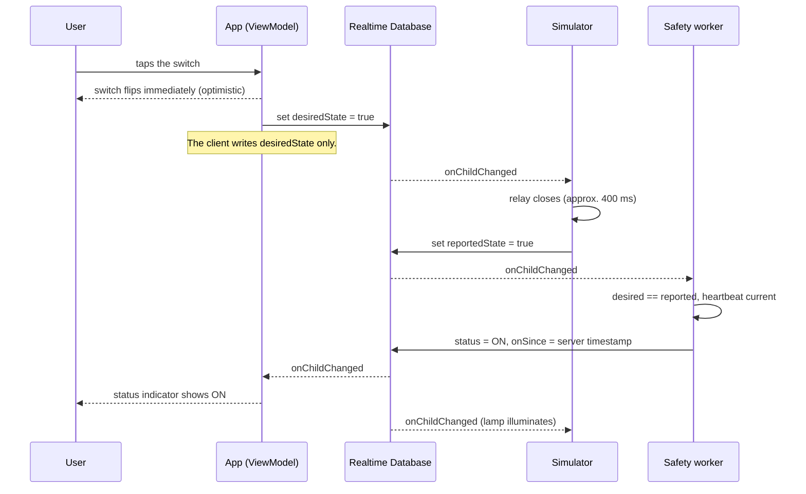
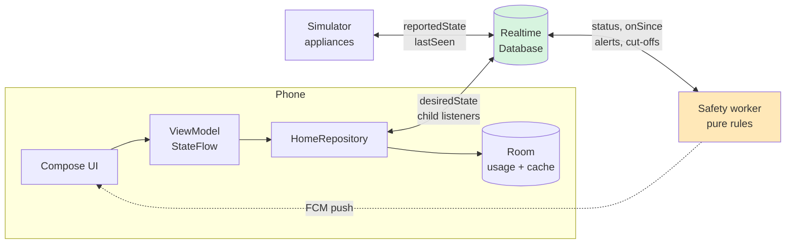

# Smart Home Monitoring and Control System

**Technical Report — SCS 3311**

| Member | Index number | Module |
|---|---|---|
| R.L. Weerasinghe | 23002204 | Synchronisation, simulator and safety worker |
| W.T. Mahagamage | 23001038 | Device profiles, control interface and reporting |
| D.M. Isakya | 23000643 | Floor representation and grid mapping |

---

## Introduction

The system comprises an Android client, a web-based hardware simulator and a
server-side worker process, all communicating through a Firebase Realtime
Database. Users manage multiple floor plans, place devices of differing
capabilities onto an abstract grid, and control them from the mobile client.
The worker enforces safety policy independently of the client.

This report covers the three areas specified for assessment: the synchronising
mechanism, the floor representation, and the simulator operations. Architecture,
verification and limitations are addressed within those sections or in the
appendices.

---

## 1. Synchronising mechanism

### 1.1 State model

The system distinguishes between three related but separate facts about every
controllable point in the house. Rather than storing a single boolean per
switch, each slot stores three:

| Field | Meaning | Written by |
|---|---|---|
| `desiredState` | The state requested by the user | Mobile client, and the worker for cut-offs and schedules |
| `reportedState` | The state the hardware confirms | Simulator |
| `status` | The reconciled value presented in the interface | Worker |

A single boolean cannot distinguish between a state that has been requested, a
state that is actually in effect, and the system's confidence in that
information. Three fields make the distinction explicit, and this is what allows
the `ERROR` and `DISCONNECTED` states to carry meaning:

- `ERROR` is raised only when `desiredState` and `reportedState` disagree for
  longer than a tolerance window of ten seconds. A brief disagreement is
  expected during normal operation, as it represents a command in transit.
- `DISCONNECTED` is raised only when a device's heartbeat is older than fifteen
  seconds. It takes precedence over all other states. Where no report has been
  received, presenting `OFF` would express an assumption as though it were an
  observation.

### 1.2 Choice of database

Firebase Realtime Database was selected in preference to Cloud Firestore for
two reasons.

First, Realtime Database supports per-child listeners. Toggling a single slot
produces one `onChildChanged` callback carrying that device, rather than a
retransmission of the whole `/devices` subtree. For a grid of independently
toggled slots this materially affects both latency and data volume.

Second, Realtime Database provides `onDisconnect()`, which allows the server to
record a client's disappearance. Without it, absence would have to be inferred
by each observer independently.

Firestore's document-level listener granularity and higher write latency are
less suited to this access pattern. The cost of the choice is the absence of
meaningful query support and a denormalised tree that must be kept consistent by
convention. This is acceptable here because the tree is small, its shape is
fixed, and it is documented in full in `docs/SCHEMA.md`.

### 1.3 Propagation of a state change

The sequence below traces a single toggle from the user's tap to the confirmed
status.

Three properties follow from this arrangement.

**Updates require no manual refresh.** The repository interface exposes no
`refresh()`, `reload()` or `fetch()` method, because none is required. The
device list is a `StateFlow` supplied directly by database child listeners, so a
change originating in the simulator, the worker or a second client arrives as a
callback and causes recomposition. The repository tests demonstrate this by
emitting a change on the source and asserting that the flow carries it, without
any call into the repository.

**Toggles are optimistic but reconciled.** The switch position changes
immediately, since waiting for a network round trip degrades the perceived
responsiveness of the interface. However, the client writes only `desiredState`
and cannot itself operate a relay. The optimistic position is therefore held for
a maximum of four seconds; if `reportedState` has not followed within that
window, the control reverts and the user is informed. Four seconds was chosen to
sit between a normal round trip and the worker's ten-second `ERROR` threshold,
so that the user is notified shortly before the status indicator changes.

**The write separation is enforced by the database.** In Realtime Database a
`.write` grant propagates to all descendants of the node at which it is
declared and cannot be withdrawn at a lower level, so a nested `.write: false`
has no effect. Validation rules, by contrast, do restrict client writes, and the
Admin SDK bypasses validation entirely. `database.rules.json` uses this
asymmetry: the fields `status`, `link`, `onSince` and `mismatchSince` carry
validators that accept a write only when the value is unchanged. An
authenticated client therefore cannot publish a status value, clear an `ERROR`,
or suppress a `DISCONNECTED`, while the worker writes these fields without
restriction.

A limitation of this approach is documented in Appendix C.

### 1.4 Offline behaviour and usage logging

Realtime Database disk persistence is enabled, so the most recently received
tree is available locally and the first frame after a cold start displays real
data rather than a loading indicator. A Room database mirrors floors, device
layout, alerts and the usage log. Live device status is deliberately excluded
from this mirror: an outdated `ON` indicator is more misleading than an honest
`DISCONNECTED`.

Usage events are append-only. Each is written at the moment of transition by
whichever component caused it, and usage is never reconstructed by comparing
successive snapshots. Reconstruction by comparison would omit every transition
occurring while the client was closed, which is precisely the period the safety
worker exists to cover.

---

## 2. Floor representation

### 2.1 Coordinate model

A device represents one physical node, occupying one grid cell with one network
connection and one heartbeat. Its position is stored as integer cell
coordinates rather than pixel offsets, so that a plan renders consistently
across screen sizes and orientations.

Translation between cell coordinates and screen coordinates is confined to a
single class, `GridMapper`, which has no Android dependencies and is therefore
testable as a plain JVM unit. Sixteen tests cover the cell-to-pixel round trip
for every cell, taps falling on the letterbox margins, taps on cell boundaries
and plan edges, degenerate zero-sized canvases, and the property that a given
cell resolves identically under phone and tablet geometry. Errors in this
arithmetic manifest as devices drawn in the wrong room, which is a class of
defect best identified by tests rather than by inspection.

Because a plan has a fixed aspect ratio and the available canvas generally does
not, the plan is fitted within the canvas with its ratio preserved, leaving
margins on two sides. All cell arithmetic is performed relative to the fitted
rectangle rather than the raw canvas bounds; otherwise the grid would stretch
with the window and device positions would drift.

### 2.2 Representation of plans

The assignment specifies an abstract and simple mapping. Plans are accordingly
declared as geometry — rooms, doorways and windows in a unit-less coordinate
space, defined in `FloorPlanSpec` — and rendered using the Compose `Canvas` API.

This approach has three advantages over bundled raster images. Rendering remains
sharp at any screen density, with no bitmap scaling. The aspect ratio is exact,
which makes the fitting calculation exact. And since the plans are original
work, no third-party image licence needs to be tracked or attributed.

Three sample plans are supplied (ground floor, first floor and an annex),
together with a blank grid. A floor record stores only the identifier of its
plan, so changing a floor's layout does not affect the devices placed on it.

### 2.3 Visual encoding

Device markers encode kind through shape and status through fill pattern:

| Attribute | Encoding |
|---|---|
| Outlet | Circle |
| Multi-switch | Square, with one indicator per addressable slot |
| Camera | Body-and-lens outline |
| `ON` | Solid fill |
| `OFF` | Plain outline |
| `ERROR` | Outline with a cross |
| `DISCONNECTED` | Dashed outline |

No state is conveyed by colour alone anywhere in the application. Status is
always presented as colour together with an icon and a text label. This is
required for accessibility, and it also ensures the interface remains legible
when projected.

Where a multi-switch unit has slots in differing states, its marker shows the
most severe of them, so that a fault on one channel is not concealed by two
functioning channels.

### 2.4 Multi-switch units

The assignment requires that a multi-switch unit be mapped to a single entity.
The data model enforces this: `Device` holds a list of `Slot` values, so a
five-gang plate is one device identifier, one grid cell and one heartbeat, with
five independently addressable slots and a master control that addresses each in
sequence. No code path produces more than one device from a single unit.

A related modelling decision concerns where scheduling and safety limits belong.
Both are properties of a slot rather than of a device kind. An iron is connected
to an ordinary socket, and a scheduled lamp may be wired to one channel of a
gang box. Modelling `HAZARD` and `LIGHT` as device kinds would make neither
arrangement expressible, and the assignment's own phrasing — "specialised slots
assigned to appliances" — indicates the same structure.

The field retains the spelling `max_on_duration` used in the specification. The
conversion to an idiomatic Kotlin property name occurs at a single point in the
data layer.

---

## 3. Simulator operations

### 3.1 Structure

The simulator is a single self-contained HTML page (`simulator/index.html`)
using the Firebase Web SDK from a content delivery network. It requires no build
step and no server. It represents the physical appliances and participates in
the protocol rather than merely displaying it.

Devices are rendered as cards grouped by floor. Lamps illuminate when their slot
is on, slots with an armed cut-off display a bar filling toward
`max_on_duration`, and cameras display a placeholder stream.

### 3.2 Write responsibilities

The simulator writes exactly two fields: `reportedState`, when its relay
changes, and `lastSeen`, at five-second intervals. It does not write `status`.
Hardware reports its condition; it does not determine how that condition is
classified. The same restriction applies to the mobile client, for the same
reason, and is enforced by the same rules file.

The simulator also registers an `onDisconnect()` handler that sets `lastSeen` to
zero. Closing the browser tab therefore causes the node to be marked
`DISCONNECTED` within the worker's fifteen-second window, with the absence
recorded by the server rather than inferred by an observer.

### 3.3 Fault injection controls

Three controls are provided, each corresponding to a specific requirement:

| Control | Behaviour | Demonstrates |
|---|---|---|
| Simulate fault | The relay ceases to act on commands | `desiredState` and `reportedState` diverge and remain divergent; after ten seconds the worker publishes `ERROR` |
| Unplug | The heartbeat stops | `lastSeen` becomes stale and the worker publishes `DISCONNECTED` |
| Physical toggle | A change originating at the hardware | The change appears in the client without a refresh, recorded with `source: SIMULATOR` |

The fault case is the most informative of the three. The simulator does not
write an error state; it simply stops responding. The error is derived by a
third process from a disagreement between two others, which is a stronger
property than an application setting an indicator on itself.

### 3.4 Safety worker

The cut-off is implemented in `worker/`, a Node and TypeScript process using the
`firebase-admin` SDK, and not in the mobile client. The requirement is that the
cut-off protects against a hazard when the phone is unavailable.

Cloud Functions would require the Blaze billing plan and a registered payment
method, so the worker is implemented as a standalone process that can be run
locally or on a free hosting tier. Each rule is written as a pure function with
an injected clock in `worker/src/rules/`, and `executor.ts` is the only module
that performs database access. The rules would therefore transfer to a Cloud
Function without modification. `docs/CLOUD_FUNCTIONS.md` documents that
migration path, including the one respect in which the present design has an
advantage: Cloud Scheduler's minimum interval is one minute, whereas the
standalone worker sweeps every thirty seconds.

Four rules are evaluated against every device:

| Rule | Function |
|---|---|
| `maxOnDurationRule` | Sets `desiredState` to false, appends a `CUTOFF` usage event, raises a critical alert and sends a push notification |
| `statusRule` | Derives `status` and maintains `onSince` and `mismatchSince` |
| `staleHeartbeatRule` | Marks a device disconnected when its heartbeat exceeds fifteen seconds |
| `scheduleRule` | Applies on and off transitions at configured minute boundaries |

### 3.5 Persistence of timer state

Timer state is held in the database rather than in process memory. The field
`onSince` is stored, and elapsed time is recomputed from it at every evaluation.

A timer implemented with `setTimeout` would be lost if the process terminated,
and would be lost without any indication that it had been. Because the state is
stored, a worker that crashes, is redeployed or loses power resumes correctly:
the next evaluation observes an appliance that has been running for forty-seven
seconds against a thirty-second limit and switches it off immediately. This
scenario is covered by a unit test, as is the requirement that the cut-off fire
at exactly `max_on_duration`.

Two triggers drive the same evaluation function. Child listeners provide
immediate reaction to changes, and a thirty-second sweep guarantees recovery
after any interruption. Since both invoke the identical function, they cannot
produce inconsistent results.

### 3.6 Schedule semantics

The schedule rule acts on transitions rather than on intervals: it applies a
change at the configured on-minute and off-minute only. Enforcing the interval
continuously would override manual control, so that a user switching a scheduled
light off at 19:00 would find it switched on again within a minute. Acting only
at boundaries allows a manual override to persist until the next boundary.

Rule application is idempotent, since at a boundary minute a write occurs only
when `desiredState` differs from the target value. The sweep therefore cannot
apply a transition twice. The consequence of this design is that a boundary
occurring entirely while the worker is unavailable is not applied
retrospectively.

---

## Appendix A — Architecture and technology

The application is written in Kotlin using Jetpack Compose with Material 3,
following the MVVM pattern: composable functions observe a ViewModel exposing
`StateFlow`, which depends on a repository, which depends on the data sources.
No composable function accesses Firebase or Room directly. The minimum supported
API level is 26 and the target is 35. The build uses the Gradle Kotlin DSL with
a version catalogue.

Dependency injection is performed manually in `AppContainer`. For an application
with a single repository, a dependency injection framework would add a further
component to be understood and defended without corresponding benefit.

Two product flavours are provided. The `live` flavour communicates with Realtime
Database. The `demo` flavour runs against an in-memory implementation that
performs the roles of simulator, worker and database, including a functioning
safety cut-off, and therefore exercises the real repository, ViewModels and
interface without network access.

Room is not required by the assignment. It is used for offline availability and
because the reporting screen aggregates usage in SQL rather than in application
code over a database snapshot.

## Appendix B — Verification

| Suite | Tests | Coverage |
|---|---|---|
| Application unit tests | 73 | Grid mapping, wire format, repository propagation, Room aggregation, CSV escaping, schedule windows |
| Worker rule tests | 40 | Cut-off timing under a controlled clock, restart recovery, status precedence, schedule boundaries |

`./gradlew assembleDebug` and `./gradlew test` complete successfully, as do
`npm test` and `tsc --noEmit` in the worker project. A continuous integration
workflow runs both suites on every push from a clone containing no credentials.

## Appendix C — Limitations

**Client roles are not distinguished.** The mobile client and the simulator both
authenticate anonymously, so the security rules cannot separate them. A modified
client could write `reportedState` as though it were hardware. Separating the
two roles would require custom authentication claims and a service to issue
them, which is outside the scope of this assignment. No client can write
`status`, which is the property on which the safety argument depends.

**A single home is supported.** The database tree is keyed by home identifier,
so support for multiple homes would be additive, but it is not implemented.

**The worker must be running.** If the worker stops, no status is derived, no
cut-off occurs and no schedule is applied. This is a single point of failure. The
simulator therefore displays the worker's own heartbeat and reports when it is
not running.

**Camera feeds are simulated,** as the assignment permits. Frames are generated
locally. The configured snapshot and stream URIs are displayed beneath the tile
so that the mechanism a real camera would use remains visible.

**Energy figures are estimates.** They assume the rated wattage is drawn for the
whole period during which an appliance is on, and are labelled as estimates
wherever they appear.

## Appendix D — Design decisions

Recorded as architecture decision records in `docs/adr/`:

| Record | Decision |
|---|---|
| 0001 | Realtime Database in preference to Firestore, for per-child listeners and `onDisconnect()` |
| 0002 | Android Gradle Plugin 8.13.2 with compileSdk 36, since current androidx releases require AGP 9 |
| 0003 | A standalone Node worker in preference to Cloud Functions, which require a billing plan |
